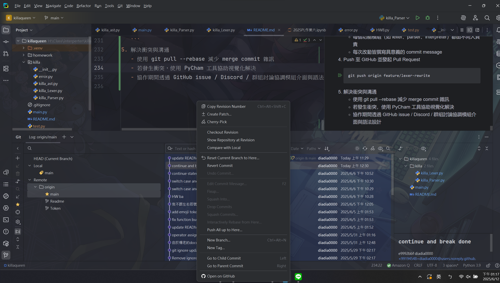

# Nttu CSIE Class: Programming Langue

## 組員
- 陳昱凱
- 林威旭
- 謝尚哲
- 游能順


##  設計理念（Language Design Philosophy）

本專案語言的設計理念，結合了學術訓練與創意實踐，目標是打造一套：

> **有趣、易懂、可擴充的教學用腳本語言。**

其設計理念分為以下幾點：

---

### 1. 語言學習第一、簡潔為本

本語言設計時考量語言教學應用，致力於：

- 使用 **簡潔明確的語法結構**，便於新手理解程式基本架構
- 移除過度繁瑣的符號與關鍵字（例如不強制括號或型別）

例如：以 emoji 取代 `var`, `print`, `return` 等常見關鍵字，讓語法 **直覺可辨識**、降低入門門檻。

---

### 2. Emoji 語法風格：視覺化語意結構

選擇 emoji 作為語法標記是基於：

- **視覺直觀性高**，能快速辨識不同語法用途（如：`🤢` 代表函式、`😭` 代表輸出）
- **趣味性強**，提升學習動機與記憶度
- 減少語言中混淆性（避免關鍵字拼寫錯誤）

---

### 3. 模組化設計：語法清晰、功能可擴充

- 每一種語句（if、while、for、switch、func）皆對應一套獨立的 parser/AST 結構，維護簡單。
- 控制流程如 `break/continue` 以 exception 流程處理，可自然擴充至更高階功能（如 try-catch、lambda）。

---

### 4. 區塊語法統一化設計（🥶）

- 所有多行語法區塊（函式、迴圈、switch）使用 `🥶` 作為明確區塊結尾。
- 避免使用縮排（類似 Python）所帶來的解析困難。
- 統一處理流程、強化語法一致性。

---


## 專案內容 : 


### Build an interpreter
本專案使用 Python 來實作一個簡單的直譯器。  


### 語言設計理念

本直譯器的目標是實作一個簡單的 **命令式編程（Imperative Programming）** 語言，並在未來擴展支援其他編程範式，如 **函數式編程（Functional Programming）** 和 **物件導向編程（Object-Oriented Programming）**。以下是主要的設計理念：


### 使用環境
python version:  3.9.6  
tool:
```bash!=
pip install ply
```
最後PLY沒用到就是了 ww

## 語法解釋
| 功能            | Emoji            |
|---------------| ---------------- |
| 變數宣告          | 🤕               |
| 加法            | 🤌               |
| 減法            | 😡               |
| 乘法            | ☹️               |
| 除法            | 🤬               |
| 布林真           | 😀               |
| 布林假           | 😫               |
| if            | if               |
| else          | else             |
| while         | 😺               |
| for  in range | 🤐 ... 🤫 🤣 ... |
| break         | 🫥               |
| continue      | 😶               |
| print         | 😭               |
| function      | 🤢               |
| block 結尾      | 🥶               |
| return        | 🍉               |
| switch        | 🤮           |
| case          | 🤧             |
| default       | 😾          |


## 語言特性

### **1.命令式編程**
  - 語法範例：
  ```txt
   🤕 x = 10;
   🤕 y = x * 2;
    if y > 15:
        😭("y is large");
  ```
#### 附值
```text
🤕 a = 10;
🤕 b = "123";
```

### **2.支援基本函數**
- 支援簡單的函數
- 語法範例
```txt
🤢 square(n):
   🍉 n * n;
🥶
😭(square(5));
```

## 使用方式  

### function
```text
🤢 greet:
    😭("bye");
🥶

greet();
```
### if else statement and logic operator
```text
🤕 x 🥳 😀;
🤕 y 🥳 😫;

if x and not y:
    😭(114514);

```

### for loop
```text
🤕 sum 🥳 0;

🤐 i 🤫 🤣  1 6:
  sum 🥳 sum 🤌 i;
🥶
😭(sum);

```
#### break(for)
```text
🤕 sum 🥳 0;

🤐 i 🤫 🤣  1 6:
  sum 🥳 sum 🤌 i;
  🫥;
🥶
😭(sum);
```
#### continue
```text
🤕 sum 🥳 0;

🤐 i 🤫 🤣  1 6:
    😶;
    sum 🥳 sum 🤌 i;
🥶
😭(sum);
```
### while loop
```text
🤕 i 🥳 1;
🤕 sum 🥳 0;

😺 i <= 5:
    sum 🥳 sum 🤌 i;
    i 🥳 i 🤌 1;
🥶
😭(i);
```
#### while break and continue
```text
same as for loop w:w
```
### switch case
```text
🤕 x 🥳 2;
🤮 x:
  🤧 1:
    😭("one");
    🫥;
  🤧 2:
    😭("two");
    🫥;
  🤧 3:
    😭("three");
    🫥;
  😾:
    😭("default");
```

##  Git + GitHub 多人協作實踐

本專案採用 Git 作為版本控制工具，並透過 GitHub 進行遠端協作與版本管理。透過這個流程，我們實踐了多人軟體開發的核心協作模式。

### 協作流程

1. **建立 GitHub repository**
   - 主線代碼集中於 `main` 分支
   - 每位成員以 feature branch 進行開發
   - clone專案到自己的電腦
   ```bash
   git clone https://github.com/diadia0000/killaqueen.git
   ```

2. **每位組員在本地建立分支**
   ```bash
   git checkout -b feature/lexer-rewrite
   ```
3. **功能開發與 commit**

    - 每個功能模組（如 lexer、parser、interpreter）都由不同人負責
    - 每次改動皆撰寫具意義的 commit message
4. Push 至 GitHub 並發起 Pull Request
   ```bash
   git push origin feature/lexer-rewrite
   ```
5. 解決衝突與溝通
   - 使用 git pull --rebase 減少 merge commit 雜訊
   - 若發生衝突，使用 PyCham 工具協助視覺化解決
   - 協作期間透過 GitHub issue / Discord / 群組討論協調模組介面與語法設計

